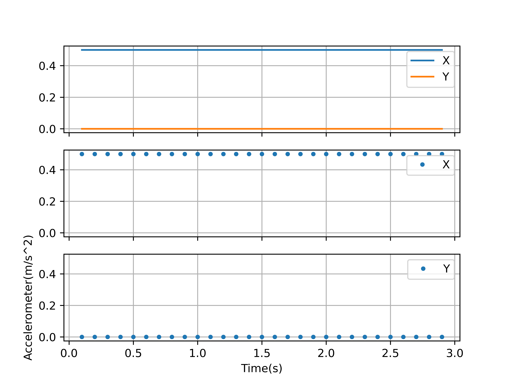
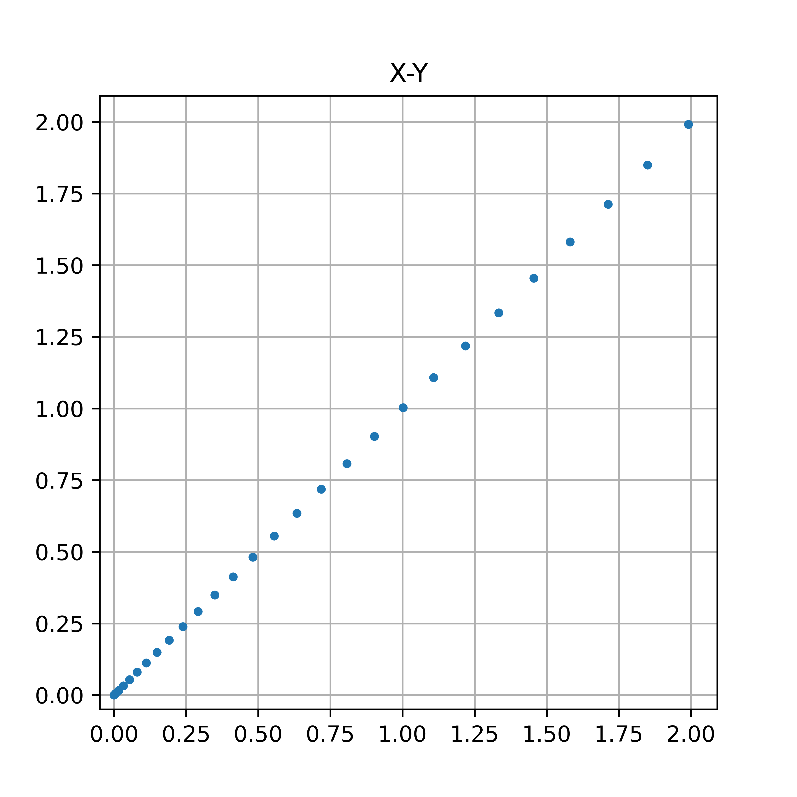

# 实验内容
虚拟实验，建立了一组理想匀加速数据测试积分是否正确。

# 代码
## [main.cpp](main.cpp)
修正代码，暂缓额外点问题。

#23 [TODO](main.cpp#23)：文件读写错误，最后一个数据未导入。
```CPP
freopen("FAccelerometer.csv","r",stdin);
getline(cin,temp);
while(cin>>ta[len1++]>>ax[len1]>>ay[len1]>>temp){}
len1-=2;
//Todo: Check out why the last number wasn't read.
//      Now just modify len1 to let it looks right.
fclose(stdin);
```
## [img_ani.py](img_ani.py)
绘制动态图像（新增）
## [img_sav.py](img_sav.py)
保存图像。
## [inter.py](inter.py)
原始数据分析
# 实验效果
正常。

[Output](out.txt)
