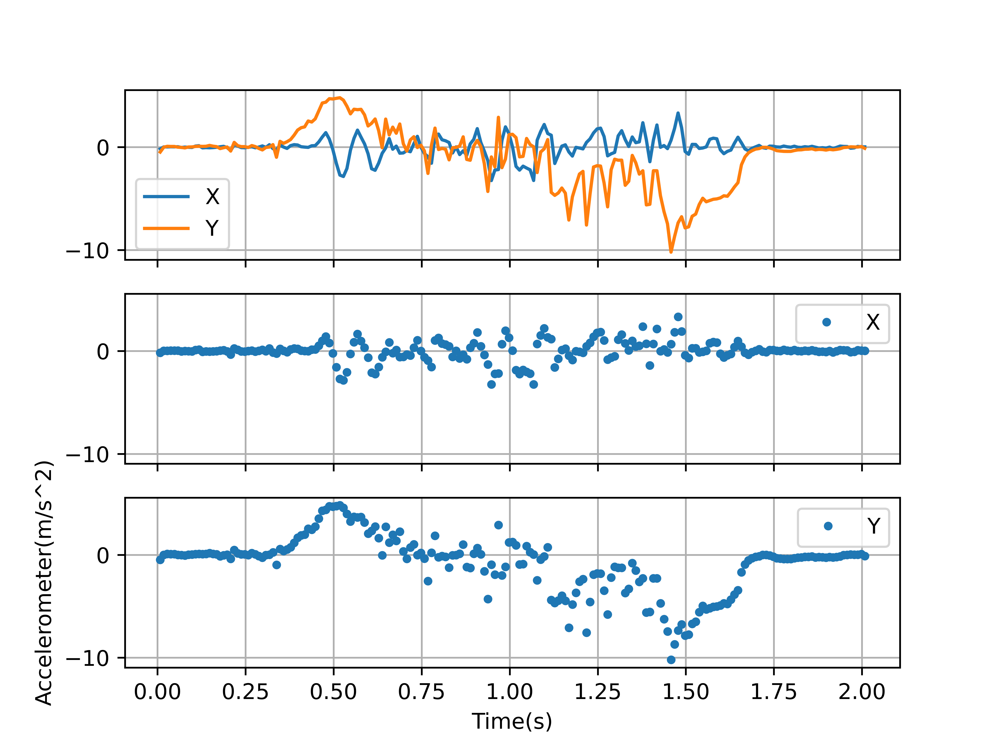
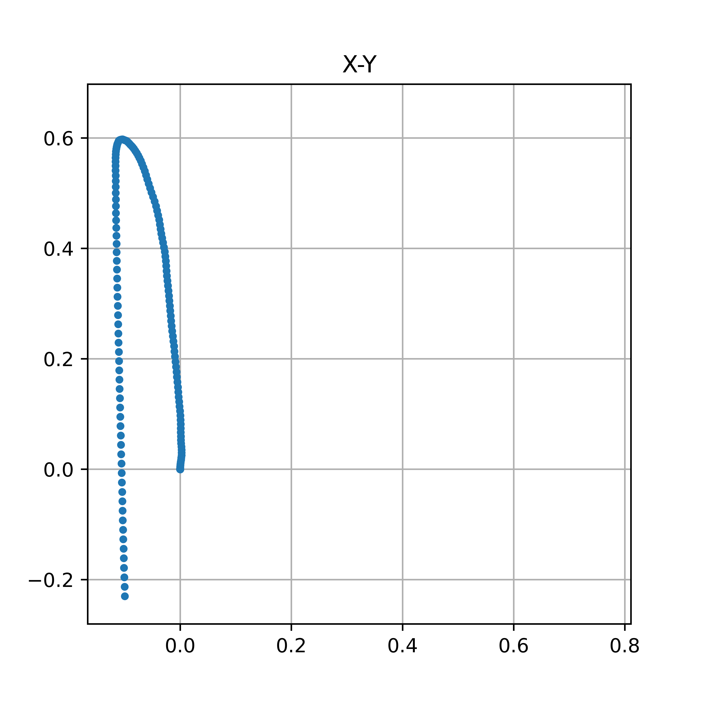

# 实验内容
推动近似加速直线。

# 实验效果
有一定问题，最后有未知反向运动，x方向有0.11左右的偏移。

[Output](out.txt)

|x|y|
|-|-|
|-0.115070|0.579834|
|-0.115682|0.575495|
|-0.116214|0.570135|
|-0.116557|0.563906|
|-0.116576|0.556944|
|-0.116410|0.549305|
|-0.116292|0.540875|
|-0.116242|0.531668|
|-0.116168|0.521785|
