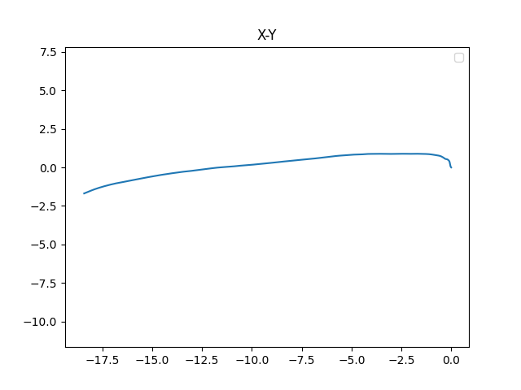

# 2022/01/01--1
[链接](20220101_1)

# 2022/01/14--1
[链接](20220114_1)

目前观察数据发现，加速度（线速度）传感器在x、y上均有极大的累计值。

||Acceleration x (m/s^2)|Acceleration y (m/s^2)
|--|--|--|
|求和|-667.79|290.8859|
|平均|-0.10974|0.047804|

猜测：g在x、y方向上有分加速度